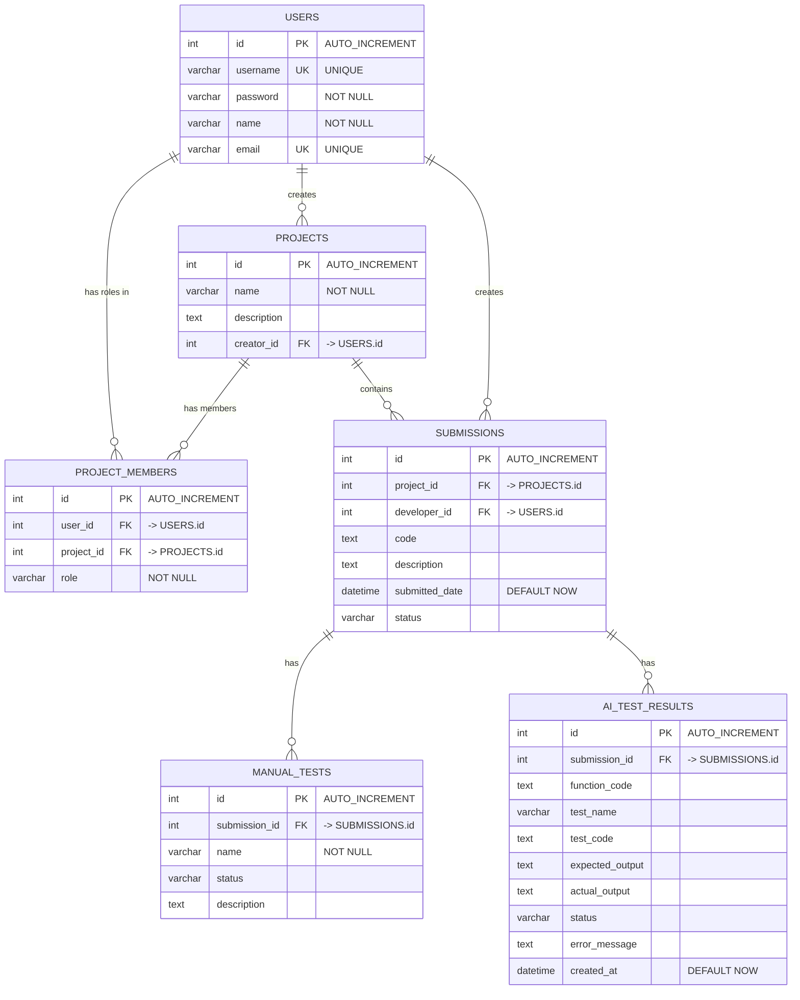

# Database Schema - Code Review System

## Entity Relationship Diagram



## How All Tables Connect

### ✅ **YES - Every Table is Connected!**

The schema forms a **fully connected graph** where all 5 tables are linked:

```
1. USERS (root table)
   ├── Connects to PROJECT_MEMBERS (via user_id FK)
   └── Connects to SUBMISSIONS (via developer_id FK)

2. PROJECTS (root table)
   ├── Connects to PROJECT_MEMBERS (via project_id FK)
   └── Connects to SUBMISSIONS (via project_id FK)

3. PROJECT_MEMBERS (junction table - bridges USERS & PROJECTS)
   ├── Connects to USERS (via user_id FK)
   └── Connects to PROJECTS (via project_id FK)

4. SUBMISSIONS (central hub)
   ├── Connects to PROJECTS (via project_id FK)
   ├── Connects to USERS (via developer_id FK)
   └── Connects to MANUAL_TESTS (one-to-many parent)

5. MANUAL_TESTS (leaf table)
   └── Connects to SUBMISSIONS (via submission_id FK)
```

**Connection Path**: Every table can be reached from any other table through foreign key relationships!

---

## Relationships Explained

### 1. **Users ↔ Projects** (Many-to-Many) via PROJECT_MEMBERS
- **Junction Table**: `PROJECT_MEMBERS`
- **Relationship**: A user can be a member of multiple projects with different roles
- **Example**: 
  - John can be a **developer** in Project A
  - John can be a **lead** in Project B
  - Sarah can be a **reviewer** in both Project A and Project B
- **Foreign Keys**: 
  - `PROJECT_MEMBERS.user_id` → `USERS.id`
  - `PROJECT_MEMBERS.project_id` → `PROJECTS.id`

### 2. **Projects ↔ Submissions** (One-to-Many)
- **Relationship**: One project can have many submissions
- Each submission belongs to exactly one project
- **Foreign Key**: `SUBMISSIONS.project_id` → `PROJECTS.id`

### 3. **Users ↔ Submissions** (One-to-Many)
- **Relationship**: One user (as developer) can create many submissions
- Each submission has exactly one developer (creator)
- **Foreign Key**: `SUBMISSIONS.developer_id` → `USERS.id`

### 4. **Submissions ↔ Manual Tests** (One-to-Many)
- **Relationship**: One submission can have many manual tests
- Each test belongs to exactly one submission
- **Foreign Key**: `MANUAL_TESTS.submission_id` → `SUBMISSIONS.id`

### 5. **SUBMISSIONS is the Central Hub**
- **Connects to 3 tables**: USERS, PROJECTS, and MANUAL_TESTS
- Acts as the main transaction/activity record in the system
- Links developers (users) working on projects with their test results

---

## Schema Tables

### **USERS**
```sql
CREATE TABLE users (
    id INT AUTO_INCREMENT PRIMARY KEY,
    username VARCHAR(255) NOT NULL UNIQUE,
    password VARCHAR(255) NOT NULL,
    name VARCHAR(255) NOT NULL,
    email VARCHAR(255) NOT NULL UNIQUE
);
```

### **PROJECTS**
```sql
CREATE TABLE projects (
    id INT AUTO_INCREMENT PRIMARY KEY,
    name VARCHAR(255) NOT NULL,
    description TEXT,
    creator_id INT,
    FOREIGN KEY (creator_id) REFERENCES users(id)
);
```

### **PROJECT_MEMBERS** (Junction Table)
```sql
CREATE TABLE project_members (
    id INT AUTO_INCREMENT PRIMARY KEY,
    user_id INT,
    project_id INT,
    role VARCHAR(50) NOT NULL,
    FOREIGN KEY (user_id) REFERENCES users(id),
    FOREIGN KEY (project_id) REFERENCES projects(id)
);
```

### **SUBMISSIONS**
```sql
CREATE TABLE submissions (
    id INT AUTO_INCREMENT PRIMARY KEY,
    project_id INT,
    developer_id INT,
    code TEXT,
    description TEXT,
    submitted_date DATETIME DEFAULT CURRENT_TIMESTAMP,
    status VARCHAR(50),
    FOREIGN KEY (project_id) REFERENCES projects(id),
    FOREIGN KEY (developer_id) REFERENCES users(id)
);
```

### **MANUAL_TESTS**
```sql
CREATE TABLE manual_tests (
    id INT AUTO_INCREMENT PRIMARY KEY,
    submission_id INT,
    name VARCHAR(255) NOT NULL,
    status VARCHAR(50),
    description TEXT,
    FOREIGN KEY (submission_id) REFERENCES submissions(id)
);
```

---

## 🧪 Detailed Test Results Storage

### **1. Manual Test Details** (MANUAL_TESTS table)
Stores all developer-submitted manual tests:

```json
// Example records in MANUAL_TESTS table:
[
  {
    "id": "test_1",
    "submission_id": "sub_123",
    "name": "Login Functionality Test",
    "status": "passed",
    "description": "Verified user can log in with correct credentials"
  },
  {
    "id": "test_2", 
    "submission_id": "sub_123",
    "name": "Error Handling Test",
    "status": "failed",
    "description": "Edge case not handled properly"
  },
  {
    "id": "test_3",
    "submission_id": "sub_123", 
    "name": "Performance Test",
    "status": "pending",
    "description": "Load time under 2 seconds"
  }
]
```

**Displayed in:**
- ✅ SubmissionDetail component (Manual Test Results section)
- ✅ AnalyticsDashboard (test pass rate calculations)

---

### **2. AI Code Analysis** (SUBMISSIONS.ai_test_results JSON field)
Stores comprehensive AI-generated analysis and test results:

```json
// Structure of ai_test_results field in SUBMISSIONS table:
{
  "total": 15,              // Total AI-generated tests
  "passed": 12,             // Number of tests passed
  "failed": 3,              // Number of tests failed
  "coverage": 85,           // Code coverage percentage
  "insights": [             // AI-generated code insights
    "Code follows best practices",
    "Good error handling implementation",
    "Missing edge case validation for empty inputs",
    "Consider adding input sanitization",
    "Performance could be optimized in loop at line 45"
  ],
  "generatedTests": [       // AI-generated test cases
    {
      "id": "ai_test_1",
      "name": "Input Validation Test",
      "status": "passed",
      "description": "Validates all input parameters",
      "code": "expect(validateInput('')).toBe(false)",
      "executionTime": 12
    },
    {
      "id": "ai_test_2",
      "name": "Null Pointer Safety Test",
      "status": "passed", 
      "description": "Checks for null pointer exceptions",
      "code": "expect(() => process(null)).not.toThrow()",
      "executionTime": 8
    },
    {
      "id": "ai_test_3",
      "name": "Edge Case: Empty Array",
      "status": "failed",
      "description": "Tests behavior with empty array input",
      "code": "expect(handleArray([])).toBeDefined()",
      "executionTime": 15,
      "errorMessage": "Expected defined but received undefined"
    }
  ],
  "codeQuality": {          // Code quality metrics
    "complexity": 6,
    "maintainability": 78,
    "securityScore": 92,
    "duplicateLines": 2
  },
  "recommendations": [      // Improvement suggestions
    "Add JSDoc comments for public functions",
    "Extract magic numbers to constants",
    "Consider breaking down complex function at line 67"
  ]
}
```

**Displayed in:**
- ✅ SubmissionDetail component (AI Code Analysis section)
- ✅ SubmissionDetail component (AI Generated Test Results section)
- ✅ AnalyticsDashboard (AI test pass rate, coverage metrics)
- ✅ SubmissionsList (AI Tested badge)

---

### **3. Complete Test Storage Summary**

| Test Type | Storage Location | Fields | Display Components |
|-----------|-----------------|--------|-------------------|
| **Manual Tests** | `MANUAL_TESTS` table | id, submission_id, name, status, description | SubmissionDetail, Analytics |
| **AI Generated Tests** | `SUBMISSIONS.ai_test_results.generatedTests[]` | id, name, status, description, code, executionTime, errorMessage | SubmissionDetail |
| **AI Insights** | `SUBMISSIONS.ai_test_results.insights[]` | Array of insight strings | SubmissionDetail |
| **AI Metrics** | `SUBMISSIONS.ai_test_results` | total, passed, failed, coverage | SubmissionDetail, Analytics |
| **Code Quality** | `SUBMISSIONS.ai_test_results.codeQuality` | complexity, maintainability, securityScore | SubmissionDetail |
| **Recommendations** | `SUBMISSIONS.ai_test_results.recommendations[]` | Array of suggestion strings | SubmissionDetail |

---

### **4. Example Complete Submission with All Test Results**

```json
{
  "id": "sub_456",
  "project_id": "proj_1",
  "project_name": "E-Commerce Platform",
  "developer_id": "user_1",
  "developer_name": "John Developer",
  "code": "function processPayment(amount, card) { ... }",
  "description": "Implemented payment processing with validation",
  "submitted_date": "2025-10-15T14:30:00Z",
  "status": "approved",
  
  // Manual Tests (linked via MANUAL_TESTS table)
  "manualTests": [
    {
      "id": "mt_1",
      "name": "Valid Card Test",
      "status": "passed",
      "description": "Processes valid card successfully"
    },
    {
      "id": "mt_2", 
      "name": "Invalid Card Test",
      "status": "passed",
      "description": "Rejects invalid card number"
    },
    {
      "id": "mt_3",
      "name": "Expired Card Test", 
      "status": "passed",
      "description": "Handles expired cards properly"
    }
  ],
  
  // AI Test Results (stored in ai_test_results JSON field)
  "ai_test_results": {
    "total": 12,
    "passed": 10,
    "failed": 2,
    "coverage": 87,
    "insights": [
      "Strong input validation",
      "Missing timeout handling for network requests",
      "Good use of error codes"
    ],
    "generatedTests": [
      {
        "id": "ai_t_1",
        "name": "Negative Amount Test",
        "status": "passed",
        "description": "Rejects negative payment amounts",
        "code": "expect(processPayment(-100, card)).rejects.toThrow()",
        "executionTime": 5
      },
      {
        "id": "ai_t_2",
        "name": "Network Timeout Test",
        "status": "failed",
        "description": "Handles network timeout gracefully",
        "code": "expect(processPaymentWithTimeout(100, card, 1)).rejects.toThrow('Timeout')",
        "executionTime": 1005,
        "errorMessage": "Function hangs instead of timing out"
      }
    ],
    "codeQuality": {
      "complexity": 7,
      "maintainability": 82,
      "securityScore": 95,
      "duplicateLines": 0
    },
    "recommendations": [
      "Add timeout configuration for payment gateway calls",
      "Consider implementing retry logic for failed transactions"
    ]
  }
}
```

---

## Example Data Flow

### **Scenario 1**: John submits CODE TEXT to Project A

1. **User**: John (id: `user_1`)
   ```json
   {
     "id": "user_1",
     "username": "john.dev",
     "name": "John Developer",
     "email": "john@company.com"
   }
   ```

2. **Project**: Website Redesign (id: `proj_1`)
   ```json
   {
     "id": "proj_1",
     "name": "Website Redesign",
     "description": "Frontend updates",
     "created_date": "2025-10-01T10:00:00Z"
   }
   ```

3. **Project Membership**: 
   ```json
   {
     "id": "pm_1",
     "user_id": "user_1",
     "project_id": "proj_1",
     "role": "developer"
   }
   ```

4. **Submission** (Code Text):
   ```json
   {
     "id": "sub_1",
     "project_id": "proj_1",
     "project_name": "Website Redesign",
     "developer_id": "user_1",
     "developer_name": "John Developer",
     "code": "function updateUI() { /* implementation */ }",
     "files": null,
     "description": "Added UI update function",
     "submitted_date": "2025-10-15T14:30:00Z",
     "status": "submitted",
     "assigned_to": ["user_2", "user_3"],
     "lead_comments": null,
     "reviewer_comments": null,
     "ai_test_results": {
       "total": 10,
       "passed": 8,
       "failed": 2,
       "coverage": 85,
       "insights": ["Good error handling", "Missing edge cases"]
     }
   }
   ```

5. **Manual Tests**:
   ```json
   [
     {
       "id": "test_1",
       "submission_id": "sub_1",
       "name": "UI Rendering Test",
       "status": "passed",
       "description": "Verified UI updates correctly"
     },
     {
       "id": "test_2",
       "submission_id": "sub_1",
       "name": "Performance Test",
       "status": "passed",
       "description": "Update completes in <100ms"
     }
   ]
   ```

---

### **Scenario 2**: Sarah submits FILE ATTACHMENTS to Project B

1. **User**: Sarah (id: `user_4`)
   ```json
   {
     "id": "user_4",
     "username": "sarah.lead",
     "name": "Sarah Johnson"
   }
   ```

2. **Project**: API Backend (id: `proj_2`)
   ```json
   {
     "id": "proj_2",
     "name": "API Backend",
     "description": "REST API development"
   }
   ```

3. **Project Membership**:
   ```json
   {
     "user_id": "user_4",
     "project_id": "proj_2",
     "role": "developer"
   }
   ```

4. **Submission** (File Attachments):
   ```json
   {
     "id": "sub_2",
     "project_id": "proj_2",
     "project_name": "API Backend",
     "developer_id": "user_4",
     "developer_name": "Sarah Johnson",
     "code": null,
     "files": [
       {
         "name": "api_routes.py",
         "path": "/uploads/proj_2/sub_2/api_routes.py"
       },
       {
         "name": "models.py",
         "path": "/uploads/proj_2/sub_2/models.py"
       },
       {
         "name": "tests.py",
         "path": "/uploads/proj_2/sub_2/tests.py"
       }
     ],
     "description": "Implemented user authentication endpoints",
     "submitted_date": "2025-10-15T16:45:00Z",
     "status": "submitted",
     "assigned_to": ["user_5"],
     "ai_test_results": null
   }
   ```
   
   **AI Testing Process**:
   - Reads files from: `/uploads/proj_2/sub_2/api_routes.py`
   - Analyzes code from file system
   - Generates test results
   - Updates `ai_test_results` field

5. **File Storage**:
   ```
   /uploads/proj_2/sub_2/
     ├── api_routes.py     (actual file on server)
     ├── models.py         (actual file on server)
     └── tests.py          (actual file on server)
   ```

---

## Complete Component-to-Database Mapping

### 📊 **Every UI Component and Its Database Tables**

| Component | Used Tables | Features Covered |
|-----------|-------------|------------------|
| **LoginScreen** | `USERS` | • User authentication<br>• Sign up new users<br>• Username/password validation |
| **DeveloperDashboard** | `USERS`<br>`PROJECTS`<br>`PROJECT_MEMBERS`<br>`SUBMISSIONS`<br>`MANUAL_TESTS` | • View assigned projects<br>• Submit new code (text or files)<br>• Add manual test results<br>• Run AI testing<br>• View own submissions<br>• Track submission status |
| **LeadDashboard** | `USERS`<br>`PROJECTS`<br>`PROJECT_MEMBERS`<br>`SUBMISSIONS` | • View submissions assigned for review<br>• Filter by project<br>• See pending reviews<br>• View AI test results<br>• Approve/reject with comments |
| **ReviewerDashboard** | `USERS`<br>`PROJECTS`<br>`PROJECT_MEMBERS`<br>`SUBMISSIONS` | • View assigned submissions<br>• See pending reviews<br>• View reviewed history<br>• Final approve/reject<br>• Add reviewer comments |
| **ProjectsArchive** | `PROJECTS`<br>`SUBMISSIONS`<br>`USERS` | • Browse all projects<br>• Search by project name<br>• View all submissions per project<br>• Download attached files<br>• View submission details |
| **AnalyticsDashboard** | `SUBMISSIONS`<br>`PROJECTS`<br>`USERS`<br>`MANUAL_TESTS` | • Total submission count<br>• Approval/rejection rates<br>• Status distribution (pie chart)<br>• Top projects (bar chart)<br>• Submission timeline (line chart)<br>• Manual test pass rates<br>• AI test pass rates |
| **ProjectManagement** | `PROJECTS`<br>`PROJECT_MEMBERS`<br>`USERS` | • Create new projects<br>• Assign users to projects<br>• Set user roles per project<br>• View project members<br>• Search users<br>• Delete projects |
| **SubmissionDetail** | `SUBMISSIONS`<br>`MANUAL_TESTS`<br>`USERS` | • View code/files<br>• See manual test results<br>• See AI test results<br>• View comments<br>• Download code<br>• Approve/reject actions |
| **SubmissionForm** | `PROJECTS`<br>`SUBMISSIONS`<br>`MANUAL_TESTS` | • Select project<br>• Enter description<br>• **Choose submission type:**<br>&nbsp;&nbsp;→ Paste code (text)<br>&nbsp;&nbsp;→ Upload files (paths)<br>• Add manual tests<br>• Submit for review |
| **RoleSwitcher** | `PROJECT_MEMBERS`<br>`USERS`<br>`PROJECTS` | • List available roles<br>• Show role per project<br>• Switch active role |
| **Navigation** | *(No database)* | • UI navigation only |

---

## File Storage Strategy

### 📁 **Code Submission: Text OR File Attachment**

```
┌─────────────────────────────────────────────────────────────┐
│               SUBMISSION FORM OPTIONS                        │
├─────────────────────────────────────────────────────────────┤
│                                                              │
│  ○ Paste Code (Text)              ○ Upload Files            │
│    └─> Stored in: code field        └─> Stored in: files[]  │
│                                                              │
└─────────────────────────────────────────────────────────────┘
```

### **Option 1: Paste Code (Text)**
```json
// Database record:
{
  "id": "sub_123",
  "code": "function hello() { return 'world'; }",
  "files": null,
  "description": "Added hello function"
}
```
- **AI Testing**: Reads code directly from `code` field
- **Display**: Shows code in text editor

### **Option 2: Upload Files (Attachments)**
```json
// Database record:
{
  "id": "sub_456",
  "code": null,
  "files": [
    {
      "name": "main.py",
      "path": "/uploads/proj_1/sub_456/main.py"
    },
    {
      "name": "utils.py", 
      "path": "/uploads/proj_1/sub_456/utils.py"
    }
  ],
  "description": "Python module implementation"
}
```
- **Storage**: Files saved to server at `/uploads/{project_id}/{submission_id}/{filename}`
- **Database**: Only stores file PATHS, not content
- **AI Testing**: Reads files from stored paths
- **Download**: Uses stored paths to retrieve files
- **Display**: Shows file names with download buttons

### **Server File Structure**
```
/uploads/
  ├── proj_1/
  │   ├── sub_456/
  │   │   ├── main.py
  │   │   └── utils.py
  │   └── sub_789/
  │       └── index.js
  └── proj_2/
      └── sub_101/
          ├── app.ts
          └── config.json
```

---

## Key Features of This Schema

✅ **Flexible Role Assignment**: Users can have different roles in different projects  
✅ **Complete Audit Trail**: Track who submitted, reviewed, and approved code  
✅ **Test Tracking**: Both manual and AI-generated tests stored with submissions  
✅ **Multi-Reviewer Support**: Multiple users can be assigned to review a submission  
✅ **Workflow States**: Clear status progression through the review pipeline  
✅ **Dual Submission Types**: Support for code text OR file attachments with path storage  
✅ **File Path Storage**: Efficient storage using paths instead of large file content  
✅ **AI Testing Access**: AI can access code from either text field or file paths  
✅ **Archive & Download**: Complete project archive with file download capability  
✅ **Analytics Ready**: All data structured for comprehensive reporting  

---

## Detailed Field Usage by Component

### 🔍 **Where Each Database Field Is Used**

#### **USERS Table Fields**
| Field | Used In Components | Purpose |
|-------|-------------------|---------|
| `id` | All dashboards, submissions | Unique identifier for linking |
| `username` | LoginScreen | Authentication, login |
| `password` | LoginScreen | Authentication (hashed) |
| `name` | All dashboards, SubmissionsList | Display developer/reviewer names |
| `email` | LoginScreen (signup), future notifications | User contact |

#### **PROJECTS Table Fields**
| Field | Used In Components | Purpose |
|-------|-------------------|---------|
| `id` | All dashboards, submissions | Unique identifier |
| `name` | ProjectsArchive, SubmissionForm, all dashboards | Display project name |
| `description` | ProjectManagement | Project details |
| `created_date` | ProjectManagement, Analytics | Tracking, sorting |

#### **PROJECT_MEMBERS Table Fields**
| Field | Used In Components | Purpose |
|-------|-------------------|---------|
| `id` | ProjectManagement | Unique identifier |
| `user_id` | All dashboards, RoleSwitcher | Link user to project |
| `project_id` | All dashboards, RoleSwitcher | Link project to user |
| `role` | RoleSwitcher, all dashboards | Determine permissions, filter data |

#### **SUBMISSIONS Table Fields**
| Field | Used In Components | Purpose |
|-------|-------------------|---------|
| `id` | SubmissionsList, SubmissionDetail | Unique identifier |
| `project_id` | All dashboards, filters | Link to project |
| `project_name` | SubmissionsList, SubmissionDetail | Display without joins |
| `developer_id` | DeveloperDashboard filter | Show only user's submissions |
| `developer_name` | SubmissionsList, SubmissionDetail | Display submitter |
| `code` | SubmissionDetail, AI testing | Display/test pasted code |
| `description` | SubmissionsList, SubmissionDetail | Show what was changed |
| `submitted_date` | SubmissionsList, Analytics timeline | Sorting, filtering |
| `status` | All dashboards, SubmissionsList | Workflow tracking, filtering |
| `assigned_to` | LeadDashboard, ReviewerDashboard | Show relevant submissions |
| `lead_comments` | SubmissionDetail | Display review feedback |
| `reviewer_comments` | SubmissionDetail | Display approval feedback |
| `ai_test_results` | SubmissionDetail, Analytics | Show AI analysis |
| `files` | SubmissionDetail, ProjectsArchive | Download files, AI testing |

#### **MANUAL_TESTS Table Fields**
| Field | Used In Components | Purpose |
|-------|-------------------|---------|
| `id` | SubmissionDetail | Unique identifier |
| `submission_id` | SubmissionDetail | Link to submission |
| `name` | SubmissionDetail | Display test name |
| `status` | SubmissionDetail, Analytics | Pass/fail display, metrics |
| `description` | SubmissionDetail | Test details |

#### **AI Test Results (JSON Field in SUBMISSIONS)**
| Field Path | Used In Components | Purpose |
|-----------|-------------------|---------|
| `ai_test_results.total` | SubmissionDetail, Analytics | Total test count |
| `ai_test_results.passed` | SubmissionDetail, Analytics | Passed test count |
| `ai_test_results.failed` | SubmissionDetail, Analytics | Failed test count |
| `ai_test_results.coverage` | SubmissionDetail, Analytics | Code coverage % |
| `ai_test_results.insights[]` | SubmissionDetail | AI code insights |
| `ai_test_results.generatedTests[]` | SubmissionDetail | Individual AI test details |
| `ai_test_results.codeQuality.*` | SubmissionDetail | Quality metrics |
| `ai_test_results.recommendations[]` | SubmissionDetail | Improvement suggestions |

---

## Dashboard Feature Breakdown

### **Developer Dashboard** Features → Database
- ✅ View assigned projects → `PROJECT_MEMBERS` (where user_id = current user)
- ✅ Submit new code → Insert into `SUBMISSIONS` with `code` field
- ✅ Upload files → Insert into `SUBMISSIONS` with `files[]` paths
- ✅ Add manual tests → Insert into `MANUAL_TESTS`
- ✅ Run AI testing → Update `SUBMISSIONS.ai_test_results`
- ✅ View own submissions → `SUBMISSIONS` (where developer_id = current user)
- ✅ Track status → `SUBMISSIONS.status`

### **Lead Dashboard** Features → Database
- ✅ View assigned reviews → `SUBMISSIONS` (where assigned_to contains user)
- ✅ Filter by pending → `SUBMISSIONS.status` = 'lead-review'
- ✅ See AI test results → `SUBMISSIONS.ai_test_results`
- ✅ Add comments → Update `SUBMISSIONS.lead_comments`
- ✅ Approve/move forward → Update `SUBMISSIONS.status`

### **Reviewer Dashboard** Features → Database
- ✅ View assigned reviews → `SUBMISSIONS` (where assigned_to contains user)
- ✅ See pending reviews → `SUBMISSIONS.status` = 'user-review'
- ✅ See reviewed history → `SUBMISSIONS.status` IN ('approved', 'rejected')
- ✅ Add comments → Update `SUBMISSIONS.reviewer_comments`
- ✅ Approve/reject → Update `SUBMISSIONS.status`

### **Projects Archive** Features → Database
- ✅ Browse all projects → `PROJECTS` table
- ✅ Search projects → Filter `PROJECTS.name`
- ✅ View submissions → `SUBMISSIONS` grouped by `project_id`
- ✅ Download files → Read from `SUBMISSIONS.files[].path`
- ✅ View details → `SUBMISSIONS`, `MANUAL_TESTS`

### **Analytics Dashboard** Features → Database
- ✅ Total submissions → COUNT(`SUBMISSIONS`)
- ✅ Approval rate → COUNT where `status` = 'approved' / total
- ✅ Status distribution → GROUP BY `SUBMISSIONS.status`
- ✅ Top projects → GROUP BY `project_name`, COUNT(*)
- ✅ Timeline → GROUP BY DATE(`submitted_date`)
- ✅ Test metrics → Aggregate `MANUAL_TESTS.status`, `ai_test_results`

### **Project Management** Features → Database
- ✅ Create project → Insert into `PROJECTS`
- ✅ Assign members → Insert into `PROJECT_MEMBERS`
- ✅ Set roles → `PROJECT_MEMBERS.role`
- ✅ View members → Query `PROJECT_MEMBERS` JOIN `USERS`
- ✅ Search users → Filter `USERS` table
- ✅ Remove members → Delete from `PROJECT_MEMBERS`

---

## Query Examples

### Get all projects where a user is a developer:
```sql
SELECT p.* 
FROM projects p
JOIN project_members pm ON p.id = pm.project_id
WHERE pm.user_id = 'user_1' AND pm.role = 'developer'
```

### Get all submissions pending review by a specific lead:
```sql
SELECT s.* 
FROM submissions s
WHERE s.status = 'lead-review'
  AND 'user_2' = ANY(s.assigned_to)
```

### Get all roles for a specific user:
```sql
SELECT p.name as project_name, pm.role
FROM project_members pm
JOIN projects p ON pm.project_id = p.id
WHERE pm.user_id = 'user_1'
ORDER BY p.name
```

### Count submissions by status for a project:
```sql
SELECT status, COUNT(*) as count
FROM submissions
WHERE project_id = 'proj_1'
GROUP BY status
```

### Get file paths for a submission (for AI testing):
```sql
SELECT files
FROM submissions
WHERE id = 'sub_456'
-- Returns: [{"name": "main.py", "path": "/uploads/proj_1/sub_456/main.py"}]
```

### Get analytics data (approval rate by project):
```sql
SELECT 
  project_name,
  COUNT(*) as total_submissions,
  SUM(CASE WHEN status = 'approved' THEN 1 ELSE 0 END) as approved,
  ROUND(SUM(CASE WHEN status = 'approved' THEN 1 ELSE 0 END) * 100.0 / COUNT(*), 2) as approval_rate
FROM submissions
GROUP BY project_name
ORDER BY approval_rate DESC
```

---

## ✅ Complete Coverage Checklist

### **All UI Components Covered**
- ✅ LoginScreen → `USERS`
- ✅ DeveloperDashboard → `USERS`, `PROJECTS`, `PROJECT_MEMBERS`, `SUBMISSIONS`, `MANUAL_TESTS`
- ✅ LeadDashboard → `SUBMISSIONS`, `USERS`, `PROJECT_MEMBERS`
- ✅ ReviewerDashboard → `SUBMISSIONS`, `USERS`, `PROJECT_MEMBERS`
- ✅ ProjectsArchive → `PROJECTS`, `SUBMISSIONS`, file paths
- ✅ AnalyticsDashboard → All tables (aggregated)
- ✅ ProjectManagement → `PROJECTS`, `PROJECT_MEMBERS`, `USERS`
- ✅ SubmissionDetail → `SUBMISSIONS`, `MANUAL_TESTS`
- ✅ SubmissionForm → `SUBMISSIONS`, `MANUAL_TESTS`, file upload
- ✅ RoleSwitcher → `PROJECT_MEMBERS`

### **All Features Covered**
- ✅ User authentication & signup
- ✅ Multi-role per user across projects
- ✅ Project creation & member management
- ✅ Code submission (text OR files)
- ✅ File path storage for AI testing
- ✅ Manual test tracking
- ✅ AI test results storage
- ✅ Workflow status tracking
- ✅ Review assignment
- ✅ Comments (lead & reviewer)
- ✅ Approval/rejection
- ✅ Analytics & reporting
- ✅ Project archive & file downloads
- ✅ Search functionality

### **Database Design Principles**
- ✅ Simple & normalized structure
- ✅ All tables connected (no orphans)
- ✅ Foreign keys maintain referential integrity
- ✅ Efficient file storage (paths not content)
- ✅ Support for both code text and file attachments
- ✅ Ready for analytics and reporting
- ✅ Scalable for future features

---

## 🎯 Summary

**This schema covers EVERYTHING in your application:**

1. **5 Tables** - All interconnected, no duplicates
2. **11 Components** - Every UI component has database backing
3. **File Handling** - Store paths (not content) for efficient access
4. **Dual Submission** - Text paste OR file upload (mutually exclusive)
5. **Complete Workflow** - Developer → Lead → AI Testing → Reviewer → Approved/Rejected
6. **Analytics Ready** - All data structured for comprehensive reporting
7. **Simple & Clean** - No unnecessary complexity

**File Upload Flow:**
1. User uploads files in SubmissionForm
2. Files saved to `/uploads/{project_id}/{submission_id}/{filename}`
3. Database stores only file paths in `files[]` array
4. AI testing reads files from paths
5. Users can download files from paths in ProjectsArchive
